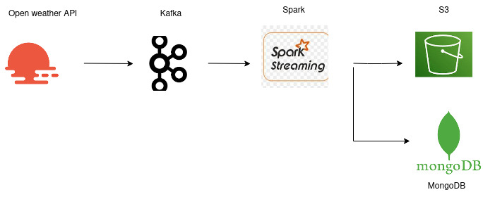

# ETL-pipeline-kafka-aws-mongodb

-In this pipeline,initially created a weather api and got the api key.

-Apache Kafka is set to start to receive data from weather api and ingested to Apache Spark.

-The data streamed by spark  was stored in AWS S3 bucket and MongoDB.
